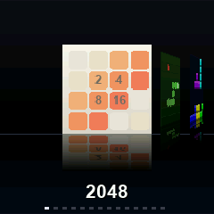
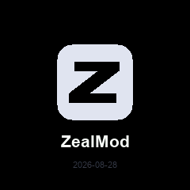
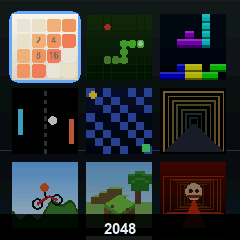

# ZealMod

Open firmware for the **Zeal Smart Timer** speedcubing timer, and the program
that builds it.

The timer stays a timer: ZealMod lives next to the stock firmware and opens on
a long button press. Inside there is a cover-flow menu, games, a clock, a
calendar, settings. You choose which programs go in and how it all looks, and
you can write and install your own programs and themes without rebuilding
anything.

<p align="center">
  
  
  
</p>

[Русская версия](docs/ru/README.md)

## What you need

* the timer itself and a USB cable **with data wires** (a charge-only one will not do);
* Python 3.9 or newer;
* once: `pip install esptool pyserial`.

Nothing else — no compiler, no drivers. The timer's socket is wired to the
native USB of its ESP32-C3, so the computer sees it on its own.

## Getting started

```sh
git clone https://github.com/ARTEMIY-FCC/ZealMod zealmod
cd zealmod
python3 studio/zealmod.py studio
```

A window opens (a page in your browser; the program runs on your computer and
sends nothing anywhere). Then:

1. the timer's port shows up in the top right — a green dot means "I see it";
2. on the left, tick the programs you want and drag them into the order you
   want them in the watch menu;
3. in the middle pick a theme and a menu style, on the right the button
   mapping and the firmware language;
4. **flash the timer** — half a minute later the watch reboots with ZealMod.

**save .gbl** gives you the image as a file: share it with a friend, and they
can install it with the same program (or with `zealmod flash file.gbl`).

Before your first flash it is worth pressing **flash backup** — a full dump of
the factory state, just in case. You can go back without it too:
**restore stock**.

## Using it on the watch

| action | how |
| --- | --- |
| open ZealMod | hold the top button for 1.5 s (configurable) |
| move around the menu | ◀ ▶ |
| launch | ▲ |
| leave a program | hold its exit button (shown in the program list) |
| back to the timer | ▼ in the menu |

The clock, the high scores and the settings survive a power cut — they live in
a flash sector, not in RAM.

## Your own programs and themes

`.zm` is a program (a game, a clock, anything), `.zt` is a theme. Both are
ordinary zip archives. To install someone else's, just drag the file onto the
Studio window: it checks whether the program fits your version of ZealMod,
shows its size and adds it to the list.

To write your own:

```sh
python3 studio/zealmod.py new app mygame   # a C scaffold
python3 studio/zealmod.py emu mygame       # run it on your computer
python3 studio/zealmod.py pack mygame      # build mygame.zm
```

That part does need a compiler (`riscv64-elf-gcc`) and SDL2 for the emulator —
but only for the author. Whoever installs the program needs none of it: a `.zm`
carries ready machine code, and Studio places it in the image and links it
against the core itself.

More: [docs/module.md](docs/module.md) — how a program is built,
[docs/api.md](docs/api.md) — the full API reference,
[docs/theme.md](docs/theme.md) — how a theme is built,
[docs/architecture.md](docs/architecture.md) — how all of this works inside.

## Command line

```
zealmod devices          what is connected over USB
zealmod build --all      compose an image with every program
zealmod flash [image]    write it to the watch
zealmod check game.zm    will this program fit
zealmod pack folder/     build a .zm from sources
zealmod new app|theme    scaffold one
zealmod emu [folder]     run it on the computer
zealmod backup           full flash backup
zealmod studio           the window
```

`--lang ru` switches the firmware texts to Russian; the Studio window has its
own language selector.

## What is in the repository

```
work/        firmware: the ZealMod core and the sources of the built-in programs
studio/      ZealMod Studio and zealmod — everything that touches the image
modules/     the list of built-in programs (builtin.json)
themes/      themes, packed into .zt files
examples/    a scaffold for your own program
dist/        the built kit: core, modules, themes, stock image
docs/        how it is put together
```

## Careful

* ZealMod overwrites the `ota_0` partition — the very place the stock timer
  firmware lives in. The factory image can always be put back: it is in
  `dist/base/zeal-stock.gbl`, and **restore stock** writes it there.
* Studio checks that the stock image in the kit matches the one the mod was
  built against. If your timer runs a different version it will say so; stop
  and take a flash backup first.
* We patch somebody else's firmware with three four-byte jumps. That is exactly
  as reliable as the version match — see `studio/zealmod/profiles/`.

## License

MIT for the ZealMod code. The stock timer firmware belongs to its manufacturer
and is kept here only so that you can go back to it.
