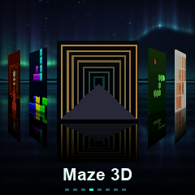

# Темы ZealMod

[English version](../theme.md)

Тема — файл `.zt`: цвета, вид меню и, если хочется, свои обои и заставка.
Перетащите его в окно Studio, и он появится в списке тем.

<p align="center">
  
  
  
</p>

## Сделать свою

```sh
python3 studio/zealmod.py new theme моя_тема
# правим моя_тема/theme.json
python3 studio/zealmod.py theme моя_тема        # получаем моя_тема.zt
```

`theme.json`:

```json
{
  "format": "zealmod-theme/1",
  "name": "My theme",         имя в интерфейсе
  "name_ru": "Моя тема",      имя, когда язык прошивки русский
  "author": "я",
  "layout": "coverflow",        coverflow | grid | list | cards
  "reflection": 42,             высота отражения, % от обложки (0 — выключить)
  "spacing": 92,                насколько разнесены обложки
  "hide_title": false,          подпись под обложкой
  "hide_dots": false,           точки-страницы внизу
  "colors": {
    "bg_top":   "#101220",      небо: верх
    "bg_bot":   "#030306",      небо: низ, у самого горизонта
    "fl_top":   "#030306",      пол: у горизонта
    "fl_bot":   "#0e0f18",      пол: у нижнего края
    "line":     "#2c3042",      сам горизонт
    "accent":   "#e6e6f0",      выделение: точка страницы, рамка, ползунок
    "text":     "#ffffff",
    "text_dim": "#3c3e4a",
    "shadow":   "#000000"       подложка под подписью
  }
}
```

Цвета можно писать как `#rrggbb`, `#rgb` или `[r, g, b]`. Экран у таймера
16-битный (RGB565), так что оттенки округляются — тонкие градиенты полосят,
лучше брать заметно разные цвета.

## Три вида меню

| `layout` | что это |
| --- | --- |
| `coverflow` | обложки в перспективе с отражениями, листаются ◀ ▶ |
| `grid` | сетка 3×3 с прокруткой, ходить всеми четырьмя кнопками |
| `list` | список с мелкими обложками |

Управление во всех трёх одинаковое: **◀ ▶** листают, **▲** запускает,
**▼** возвращает в таймер.

## Обои и заставка

Положите рядом с `theme.json`:

* `wallpaper.png` — 240×240, станет фоном меню вместо градиента;
* `logo.png` — 128×128, покажется на заставке вместо знака ZealMod.

<p align="center">
  
  
  
</p>

`zealmod theme` сам переведёт их в формат экрана. Обои занимают 115 КБ в
образе — это заметная доля свободного места, так что с ними влезет меньше
программ; Studio покажет остаток внизу окна.

## Откуда берутся встроенные темы

Из каталога `themes/` — там лежат `mint`, `sunset`, `matrix`, `tiles`, `space`
и `aurora` (последние две — с обоями и своим логотипом). Рядом с `aurora`
лежит и скрипт, который эти обои рисует (`make_art.py`): сцена посчитана под
перспективу самого меню, поэтому отражения обложек, которые рисует прошивка,
попадают в отражение, нарисованное на воде.

Это обычные каталоги с `theme.json`; `zealmod mods` пакует их в `dist/themes/*.zt`
вместе со всем остальным комплектом. Скопируйте любую и правьте — так проще
всего начать.
