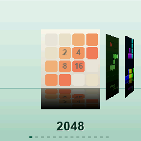
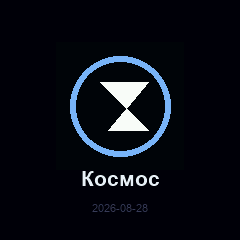
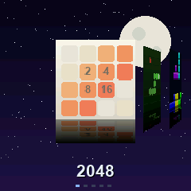

# ZealMod themes

[Русская версия](ru/theme.md)

A theme is a `.zt` file: colours, menu style and, if you like, your own
wallpaper and splash logo. Drag it onto the Studio window and it appears in the
theme list.

<p align="center">
  
  
  
</p>

## Making one

```sh
python3 studio/zealmod.py new theme mytheme
# edit mytheme/theme.json
python3 studio/zealmod.py theme mytheme        # produces mytheme.zt
```

`theme.json`:

```json
{
  "format": "zealmod-theme/1",
  "name": "My theme",
  "name_ru": "Моя тема",
  "author": "me",
  "layout": "coverflow",
  "reflection": 42,
  "spacing": 92,
  "hide_title": false,
  "hide_dots": false,
  "colors": {
    "bg_top":   "#101220",
    "bg_bot":   "#030306",
    "fl_top":   "#030306",
    "fl_bot":   "#0e0f18",
    "line":     "#2c3042",
    "accent":   "#e6e6f0",
    "text":     "#ffffff",
    "text_dim": "#3c3e4a",
    "shadow":   "#000000"
  }
}
```

| key | what it does |
| --- | --- |
| `name_ru` | the caption when the firmware language is Russian |
| `layout` | `coverflow`, `grid` or `list` |
| `reflection` | reflection height, % of the cover (0 turns it off) |
| `spacing` | how far apart the covers stand |
| `hide_title`, `hide_dots` | drop the caption / the page dots |
| `bg_top`, `bg_bot` | the sky: top, and down at the horizon |
| `fl_top`, `fl_bot` | the floor: at the horizon, and at the bottom edge |
| `line` | the horizon itself |
| `accent` | selection: page dot, frame, slider |
| `text`, `text_dim`, `shadow` | captions and the shadow under them |

Colours accept `#rrggbb`, `#rgb` or `[r, g, b]`. The screen is 16-bit
(RGB565), so shades get rounded — subtle gradients band, and clearly different
colours look better.

## Three menu styles

| `layout` | what it is |
| --- | --- |
| `coverflow` | covers in perspective with reflections |
| `grid` | a 3×3 grid that scrolls |
| `list` | a list with small covers |

The controls are the same in all three: **◀ ▶** move, **▲** launches,
**▼** goes back to the timer.

## Wallpaper and splash

Put these next to `theme.json`:

* `wallpaper.png` — 240×240, becomes the menu background instead of the gradient;
* `logo.png` — 128×128, shows on the splash screen instead of the ZealMod mark.

<p align="center">
  
  
</p>

`zealmod theme` converts them to the screen format for you. A wallpaper takes
115 KB in the image — a noticeable slice of the free space, so fewer programs
fit alongside it; Studio shows what is left at the bottom of the window.

## Where the built-in themes come from

From the `themes/` directory — `mint`, `sunset`, `matrix`, `tiles` and `space`
(the last one has a wallpaper and its own logo, as an example). They are plain
directories with a `theme.json`; `zealmod mods` packs them into
`dist/themes/*.zt` along with the rest of the kit. Copy one and edit it — that
is the easiest way to start.
